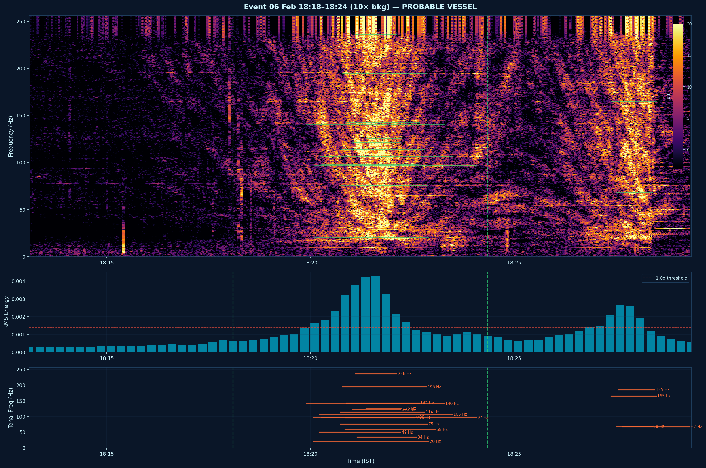
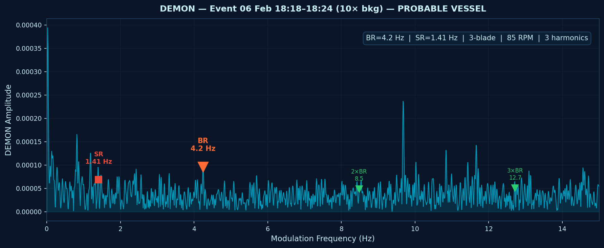
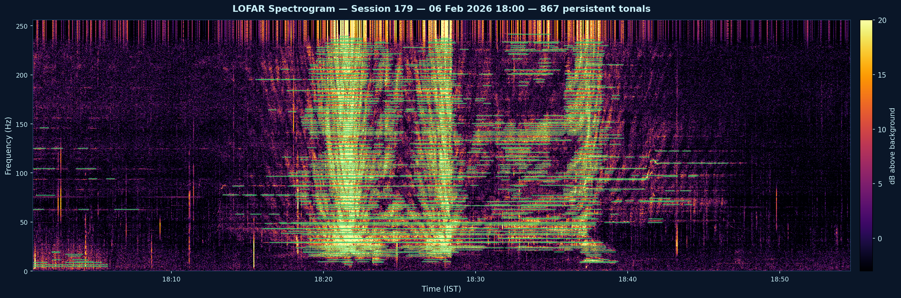

# HAVS Hydrophone Analysis Pipeline

Automated three-stage passive acoustic vessel detection and classification from seabed-deployed hydrophone recordings.

Processes continuous WAV recordings, detects vessel transits, extracts acoustic signatures, and produces HAVS proforma reports with LOFAR spectrograms and DEMON modulation analysis.

---

## Sample Output

### Event Spectrogram (3-panel)

LOFAR spectrogram with background normalisation, RMS energy profile, and detected persistent tonal lines. Green dashed lines mark event boundaries.



### DEMON Modulation Spectrum

Blade-rate, shaft-rate, and harmonic detection from the Hilbert envelope of the peak-energy window.



### LOFAR Session Spectrogram

Full 1-hour session showing vessel transit with characteristic tonal fingerprint across 0–256 Hz.



---

## Installation

```bash
pip install -r requirements.txt
```

Requires **Python 3.8+**. No GPU needed.

### Dependencies

| Package | Purpose |
|---------|---------|
| numpy | Numerical computation |
| scipy | Signal processing (STFT, Hilbert, Welch) |
| soundfile | WAV file I/O |
| openpyxl | HAVS Excel report generation |
| matplotlib | Spectrogram and figure generation |

---

## Quick Start

```bash
cd analysis_pipeline
python run_pipeline.py <wav_directory> -o <output_directory>
```

```bash
# Process two input folders, sessions 113-160
python run_pipeline.py C:\goadata3 C:\goadata4 -o results -s 113-160

# Process all WAV files in a directory
python run_pipeline.py /data/recordings -o results

# Fast run — skip spectrogram images
python run_pipeline.py /data/recordings -o results --no-spectrograms

# Resume after interruption
python run_pipeline.py /data/recordings -o results --resume
```

### Command-Line Options

| Option | Description |
|--------|-------------|
| `input` | One or more directories containing WAV files |
| `-o`, `--output` | Output directory (required) |
| `-s`, `--sessions` | Session range, e.g. `113-160` or `all` (default: all) |
| `--no-spectrograms` | Skip all image generation (faster) |
| `--resume` | Resume from last checkpoint if interrupted |

---

## Data Setup

WAV files are 1-hour segments recorded by a seabed hydrophone. File naming convention: `session_NNN_*.wav` where NNN is the session number.

**If data is on SharePoint**, get it locally via one of:

1. **OneDrive Sync** — Open the SharePoint folder in browser → click **Sync**. Files sync to `C:\Users\<you>\<OrgName>\...`

2. **Manual download** — Select all files in the SharePoint folder → **Download** → extract the zip.

3. **Map as network drive** — File Explorer → right-click This PC → Map Network Drive → paste the SharePoint folder URL.

---

## Pipeline Architecture

```
WAV Files
    │
    ├─── Stage 1: RMS Energy ──────── broadband power per 30s window
    │                                  primary vessel detection layer
    │
    ├─── Stage 2: LOFAR/STFT ──────── spectrogram (0.125 Hz resolution)
    │                                  background normalisation
    │                                  persistent tonal detection
    │
    └─── Stage 3: DEMON ────────────── Hilbert envelope extraction
         (conditional: elevated-RMS     blade-rate / shaft-rate estimation
          windows only)                 harmonic scoring
                                        vessel classification
    │
    ├─── Event Detector ────────────── temporal grouping of detections
    │                                  significance classification
    │
    └─── Output ────────────────────── HAVS Excel proforma
                                       transit events CSV
                                       LOFAR session spectrograms
                                       event spectrograms + DEMON plots
```

### Stage 1: RMS Energy Detection

Computes broadband RMS power for each 30-second window (15s hop, 50% overlap). A statistical threshold (configurable, default 1.0σ above mean) flags elevated-energy windows. This is the primary detection layer — vessels produce clear energy signatures above ambient background.

### Stage 2: LOFAR Spectrogram Analysis

Short-Time Fourier Transform with 4s windows, 75% overlap, 2× zero-padding yields 0.125 Hz frequency bins up to 256 Hz. Background normalisation (median spectrum subtraction) reveals tonal lines from rotating machinery. Persistent tonals (≥30s duration, >8 dB above background) are detected and grouped into 2 Hz bands.

### Stage 3: DEMON Blade-Rate Extraction

Runs **only** on windows where Stage 1 flags elevated RMS energy. Applies bandpass filtering, Hilbert envelope extraction, and FFT of the envelope to find blade-rate modulation frequencies (2–15 Hz). Scores harmonic consistency (2×, 3×, 4× blade rate plus shaft-rate sub-harmonic). Estimates blade count, shaft rate, and propeller RPM.

### Event Detection

Elevated-RMS windows are grouped temporally (±120s merge window, minimum 5 windows). Each event gets: start/end time, duration, peak/mean RMS, median blade rate, shaft rate, tonal frequencies, vessel classification, and confidence level.

---

## Output Files

| File | Description |
|------|-------------|
| `havs_results.xlsx` | HAVS proforma — one row per tonal frequency per event, with harmonic detection |
| `transit_events.csv` | All detected events with timestamps, durations, rates, and classification |
| `_checkpoint.json` | Processing state for `--resume` |

### Spectrogram Images (unless `--no-spectrograms`)

| File Pattern | Description |
|-------------|-------------|
| `lofar_session_NNN.png` | Per-session LOFAR spectrogram (0–256 Hz) with detected tonals overlaid |
| `event_YYYYMMDD_HHMM_NNx.png` | 3-panel event analysis: LOFAR spectrogram + RMS profile + tonal lines |
| `demon_YYYYMMDD_HHMM_NNx.png` | DEMON modulation spectrum with blade-rate, harmonics, shaft-rate marked |

Event and DEMON plots are generated for events ≥5× background energy.

---

## Configuration

All parameters are in `config.py`. Key tuning parameters:

### Detection Sensitivity

| Parameter | Default | Effect |
|-----------|---------|--------|
| `RMS_SIGMA_THRESHOLD` | 1.0 | Lower = more sensitive, more false positives |
| `EVENT_MIN_WINDOWS` | 5 | Minimum detection duration (~75s at 15s hop) |
| `SIGNIFICANT_RMS_FACTOR` | 5.0 | ×background for "significant" event classification |
| `EVENT_SPEC_MIN_RMS_FACTOR` | 5.0 | ×background to generate event/DEMON plots |

### Tonal Detection

| Parameter | Default | Effect |
|-----------|---------|--------|
| `TONAL_THRESHOLD_DB` | 8.0 | dB above background to flag as tonal |
| `TONAL_MIN_PERSIST_SEC` | 30 | Minimum tonal persistence |
| `TONAL_FREQ_MIN_HZ` | 3.5 | Ignore below this frequency |

### DEMON

| Parameter | Default | Effect |
|-----------|---------|--------|
| `DEMON_BLADE_RATE_MIN_HZ` | 2.0 | Blade-rate search range lower bound |
| `DEMON_BLADE_RATE_MAX_HZ` | 15.0 | Blade-rate search range upper bound |
| `DEMON_SCORE_THRESHOLD` | 5.0 | Minimum score for DEMON detection |

### Visual

| Parameter | Default | Description |
|-----------|---------|-------------|
| `GENERATE_FILE_SPECTROGRAMS` | True | Per-session LOFAR images |
| `GENERATE_EVENT_SPECTROGRAMS` | True | Event detail + DEMON images |
| `STYLE` | deep-ocean | Dark navy theme with teal/orange accents |

---

## HAVS Output Format

The HAVS Excel proforma matches the standard template:

| Column | Content |
|--------|---------|
| A: Date | dd/mm/yyyy |
| B: Session | Session number(s) |
| C: Time | HH:MM–HH:MM |
| D: Spectrogram Primary Frequencies | One frequency per row (up to 5 per event) |
| E: Spectrogram Harmonics | Detected 2×, 3×, 4× multiples, or "Not Present" |
| F: LOFAR Primary Frequencies | Mirrors column D |
| G: LOFAR Harmonics | Mirrors column E |
| H: DEMON Blade Rate (Hz) | From Stage 3 |
| I: DEMON Shaft Rate (Hz) | From Stage 3 |
| J: Event | Classification (CONFIRMED VESSEL / PROBABLE VESSEL / TRANSIENT) |
| K: Remarks | Confidence, blade count, RPM, RMS ratio |

---

## Module Reference

| Module | Purpose |
|--------|---------|
| `run_pipeline.py` | Entry point — orchestrates all stages |
| `config.py` | All tunable parameters |
| `stage1_rms.py` | RMS energy computation |
| `stage2_lofar.py` | STFT spectrogram, background normalisation, tonal detection |
| `stage3_demon.py` | Hilbert envelope, blade-rate extraction, harmonic scoring |
| `event_detector.py` | Temporal grouping and event classification |
| `havs_writer.py` | HAVS Excel proforma output |
| `spectrogram_writer.py` | All image generation |

---

## Performance

Tested on seabed hydrophone recordings (512 Hz, 1-hour WAV segments):

| Metric | Value |
|--------|-------|
| Processing speed | ~288 sessions in ~83 minutes (CPU only) |
| Per-session time | ~17 seconds (processing + spectrogram generation) |
| Per-session time (no images) | ~5 seconds |
| Memory usage | <500 MB |

---

## Technical Notes

- **512 Hz sample rate**: Nyquist at 256 Hz. Sufficient for machinery tonals and blade-rate signatures. Cavitation analysis requires >20 kHz and is not applicable at this sample rate.

- **Shallow-water environment**: Persistent swell-seabed modulation produces harmonic-like structure in the DEMON spectrum. The pipeline accounts for this by using RMS energy as the primary detection layer rather than relying solely on DEMON harmonic scoring.

- **DEMON conditional execution**: Stage 3 only processes windows where Stage 1 flags elevated energy. This avoids wasting computation on ambient windows where DEMON scores saturate due to environmental harmonics.

- **Checkpoint/resume**: Processing state is saved every 5 files (configurable). If interrupted, `--resume` continues from the last checkpoint.

- **Corrupted files**: WAV files that fail to load are skipped with a warning. Processing continues with remaining files.

---

## License

Proprietary — © Oravont Systems LLP. All rights reserved.

---

## Contact

Oravont Systems LLP  
Capt (Dr) Sunil Tyagi  
